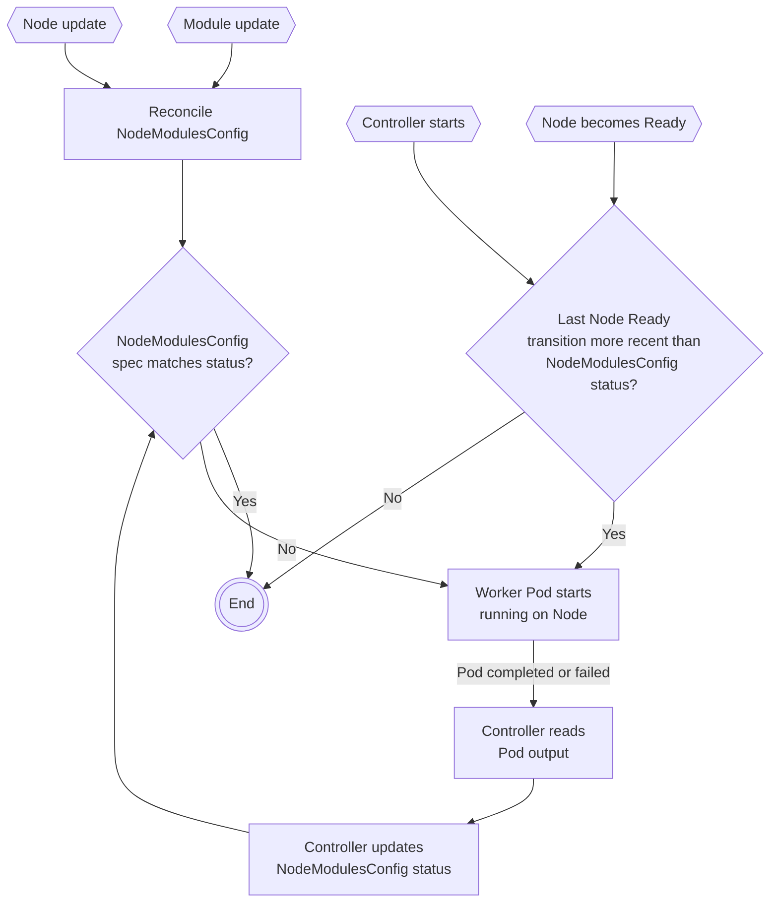

# Worker pods for KMM

Authors: @qbarrand, @yevgeny-shnaidman, @mresvanis

## Introduction

This enhancement aims at eliminating several pain points related to how KMM loads kernel modules on nodes.

### Reliability

Running user-provided ModuleLoader images as DaemonSets makes it difficult for KMM to determine if a module was
successfully unloaded or not.  
KMM uses the `preStop` hook to run `modprobe -r` and unload modules.
`preStop` hook failures cannot prevent the Pod from being terminated.  
If `modprobe` cannot unload the module for any reason (e.g. userspace applications still using it), then the Pod will
be terminated anyway and the `kmm.node.kubernetes.io/$namespace.$module.ready` label will be removed from the Node, even
though the module is still loaded.

### Operator upgrades

The use of `postStart` and `preStop` hooks in ModuleLoader Pods means that any Pod restart or termination can unload the
kernel module.
This makes updating the DaemonSet spec impossible without interrupting the workload that depends on the kmod, because
the DaemonSet controller will terminate the existing Pods and create new ones with the updated PodSpec.  
Another issue is DaemonSet immutable fields; trying to update the `.spec.selector` will fail, which can make it
challenging to improve the way KMM manages DaemonSets.

### Resource utilization

KMM currently creates one DaemonSet per `Module` and compatible kernel version found in the cluster.
Formally, the number of DaemonSets created $S$ is defined by:
$$S = \sum_{i=1}^nk_i$$

where:
- $n$ is the number of `Modules` in the cluster, and;
- $k_i$ is the number of kernel versions running in the cluster that `Module` $i$ is compatible with.

A big $S$ leads to unnecessary workload for the cluster:
- on nodes, one ModuleLoader Pod is created per `Module`. Although those just sleep after the `modprobe`
  `postStart` hook, each running pod incurs an overhead for the container runtime and the kubelet;
- on the control-plane, a higher number of DaemonSets and Pods creates more events for kube-controller-manager, which
  trigger more reconciliations and status updates.

## Goals

1. Improve the reliability of module loading and unloading
2. Improve operator upgrade experience
3. Reduce the overall KMM footprint

## Non-goals

1. Add further control on the deployment of kmods on nodes

## Design

### KMM: worker Pods pulling kmod images

This proposal moves from ModuleLoader DaemonSets to standalone, one-shot Pods.
KMM is now composed of two components:
- the operator;
- the worker Pods.

```
               ┌───────┐
               │       │
               │ Nodes ◄──┐
               │       │  │
               └───────┘  │ watches
                          │
             ┌─────────┐  │
             │         │  │
             │ Modules │  │     ┌───────────────────────┐
             │         │  │     │                       │
             └─────▲───┘  │     │ ┌───────────────────┐ │
                   │      │     │ │                   │ │  creates & owns
        watches &  └──────┴─────┼─┤ Module controller ├─┼──────────────────┐
        updates status          │ │                   │ │                  │
                                │ └───────────────────┘ │           ┌──────▼────────────┐
                                │                       │           │                   │
                                │                       │           │ NodeModulesConfig │
┌────────────┐                  │ ┌───────────────────┐ │           │                   │
│            │                  │ │                   │ │           └──────▲────────────┘
│ KMM worker ◄──────────────────┼─┤ NodeModulesConfig │ │                  │
│    Pod     │  creates & owns  │ │ controller        ├─┼──────────────────┘
│            │                  │ │                   │ │   watches &
└──────┬─────┘                  │ └───────────────────┘ │   updates status
       │                        │                       │
       │                        │          KMM operator │
       │                        └───────────────────────┘
       │
       │
       │                        ┌──────────────────────┐
       │                        │                      │
       └────────────────────────► registry.example.org │
                pulls from      │                      │
                                └──────────────────────┘
```

#### The operator

The operator runs two main controllers: the `Module` controller and the `NodeModulesConfig` controller.

The `Module` controller watches both `Module` and `Node` resources to determine which kmods should be loaded on which
`Node`.
It creates one `NodeModulesConfig` resource per `Node`.
`NodeModulesConfig` resources represent the desired state of all `Modules` targting the node; they contain all the
required data to pull kmod images and load the modules properly.  
The `Module` controller watches updates to the `status` of `NodeModulesConfig` objects and aggregates that data into the
`Module` `status`.

The `NodeModulesConfig` controller watches `NodeModulesConfig` resources and determines when a worker Pod needs to be
started on a node by looking at the difference between the desired state (spec) and the current one (status).  
One worker Pod is created per `Node` and per `Module`.  
When the Pod has completed, the controller reads its outcome and updates the `NodeModulesConfig` status accordingly.

When updating the `NodeModulesConfig` status, the controller includes a timestamp corresponding to the last time a
worker Pod ran on the node.
This timestamp can be used to verify if a new worker Pod needs to run when the KMM operator restarts; if it is older
than the last transition of the `Node`'s `Ready` condition, then the node may have rebooted and we potentially need to
load the kernel modules.

#### The worker Pods

Worker Pods are created by the `NodeModulesConfig` controller.
They run KMM code that reads the configuration file, pulls and extracts kmod OCI images and uses `modprobe` to load or
unload kmods.  
The configuration file is provided as an annotation to the Pod object and mounted in its filesystem via the [Downward
API](https://kubernetes.io/docs/concepts/workloads/pods/downward-api/).

##### Security

Worker Pods run a privileged container but are granted zero privilege on the API Server.

##### kmod images

It is worth noting that worker Pods pull the kmod image from registries **into their filesystem**, not the node's.
That filesystem disappears as soon as the Pod is terminated.  
This means that node image caching mechanisms cannot be leveraged, and any Pod creation will entail data transfers from
the kmod image's registry to the Pod.

This concern is mitigated by dropping the requirements on the kmod image.
The worker image contains all the utilities required to load the kernel modules, and the kmod image is now merely a
vehicle for `.ko` and `depmod` dependency files.  
This results in much smaller images that can be based off `scratch` in most cases.

##### Setting the firmware lookup path

Worker Pods will be able to write the firmware lookup path to `/sys/module/firmware_class/parameters/path` each time
they run.
This behaviour will be controlled by an operator setting, which will be written as part of the worker configuration.

#### High-level reconciliation loop



#### Device plugins

KMM will still run the device plugin specified in the `Module` resource as a DaemonSet.
The controller still adds the `kmm.node.kubernetes.io/$namespace.$module.ready` label on nodes that is relied upon to
schedule the DaemonSet.

#### Image builds and kmod signing

Those flows are not affected by this change.

#### Addressing goals

This design addresses the goals stated at the beginning of this proposal:

1. **Improve the reliability of module loading and unloading**  
   KMM now runs its own code in the pod, which gives us a lot more control in error handling.

2. **Improve operator upgrade experience**  
   Worker pods are one-off, short-lived objects.
   We never try to update them and are not constrained by spec changes and immutable selectors.

3. **Reduce the overall KMM footprint**  
   We now run only one Pod per Node, for only a short amount of time.

### KMM-Hub

KMM-Hub is not affected by this change.

## API changes

We do not foresee any change to the existing APIs, including `Module`, for this enhancement.  
The new `NodeModulesConfig` CRD will be strictly internal to KMM and should not be relied upon for any purpose.  
Kernel version labeling for nodes will be dropped as it is not required to schedule ModuleLoader Pods anymore.

## Upgrading from DaemonSet-based KMM

There is no practical way of deleting the existing ModuleLoader DaemonSets without running their Pods' `preStop` hook.
That hook runs `modprobe -r` and unloads the kernel module(s).  
This means that transitioning from DaemonSets to the new system will entail an interruption of the workload utilizing
the kernel module.  

To minimize the downtime, we may add an additional controller that leverages the DaemonSet `OnDelete` strategy to delete
the existing Pods one node at a time, and reload kmods with the new worker Pods.  
Another solution would be for users to run a small userspace application utilizing the kmod that they do not want
unloaded; because the `preStop` hook does not prevent the termination of current ModuleLoader Pods, those would be
deleted and the new worker Pods would be able to run as expected.

## Semantics

We propose to move away from "ModuleLoader images" to "kernel module images" or "kmod images", since the user-provided
images are only a container for the `.ko` files and are not loading the modules themselves anymore.
