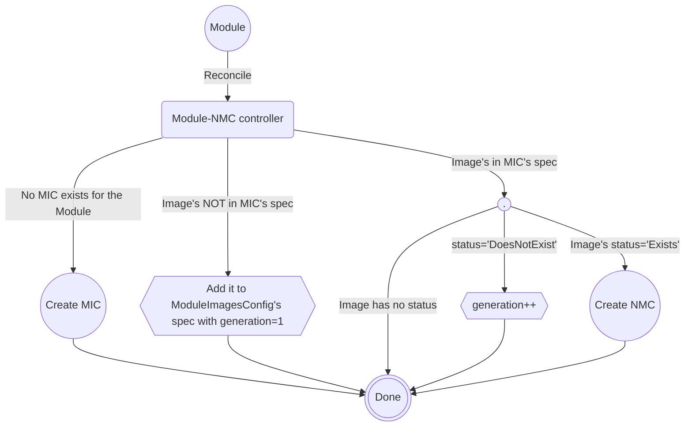
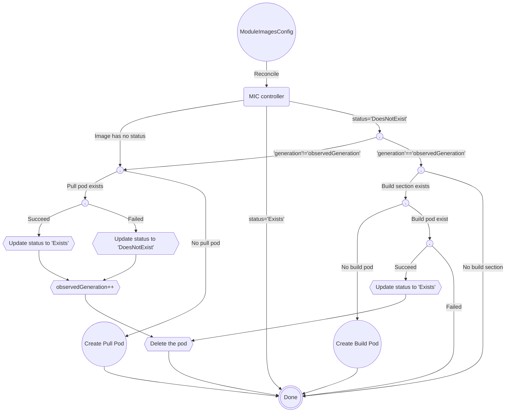

# Using the container-runtime to check images existance

Authors: @ybettan, @yevgeny-shnaidman

## Introduction

This enhancement aims at eliminating several pain points related to how KMM checks if container images exists.

The current implementation of KMM is checking whether images exists by generating an HTTP[s] request to the
container registry. It requires KMM to manually access a bunch of configurations files on the nodes such as:
* Container images mirroring configs
* TLS configs
* Installed CAs

In addition to that, in order to reduce the number of registy accesses, we also need to maintain a cache as
we do for the Hub&Spoke topology.

[We recently started using the cluster's container-runtime for pulling kmod images from the worker pods](https://github.com/kubernetes-sigs/kernel-module-management/pull/886) which was a great step forward to maximum automation for pulling images
in the cluster. Once we start checking the images existance using the container-runtime as well, we will be
at ~100% automation for handlering images - everything the cluster does when pulling images, KMM will do as well.

## Goals

1. Remove the need for KMM to pull the images by itself using HTTP[s] and specific
   configuration, and instead rely on the built-in kubernetes functionality and cache.

## Non-goals

1. Add further control for building/signing kmod images.

## Design

### The new `ModuleImagesConfig` CRD

The new CRD will hold information regarding the existance of images mentioned in `Module` objects.
The cluster will contain a single `ModuleImagesConfig` per `Module` in the cluster.
The `generation` and `observedGeneration` are used to trigger the `ModuleImagesConfig` controller in some cases.

```yaml
apiVersion: kmm.sigs.x-k8s.io/v1beta1
kind: ModuleImagesConfig
metadata:
  ...
  ...
spec:
  items:
    - image: registry.example.com/org/kmod1:kver
      generation: 1 # default value
    - image: registry.example.com/org/kmod2:kver
      generation: 2
      build:
        ....
      sign:
        ...
    - image: registry.example.com/org/kmod3:kver
      generation: 1 # default value
status
  obserevedGeneration: 1
  items:
    - image: registry.example.com/org/kmod1:kver
      status: Exists
      observedGeneration: 1
    - image: registry.example.com/org/kmod2:kver
      status: DoesNotExist
      observedGeneration: 1
```

### Module-NMC controller's changes

* The only controller creating or modifying `ModuleImagesConfig` objects - one per `Module`
* Update `ModuleImagesConfig`'s spec by adding/modifying/removing entries.
* Checking `ModuleImagesConfig`'s status to determine whether the defined image exists in the image
  repository or not.
* Continues to create `NodeModulesConfig` objects as before.



### ModuleImagesConfig controller (MIC) (previously called the BuildSign controller) changes

* Continue to build/sign kmods as before
* Creating pods to check if images exists and updates the `ModuleImagesConfig`'s status accordingly
* Remove `ModuleImagesConfig`'s status entries that were removed from `spec`.

**The following chart only describe the new functionality added to the controller.**


## Addressing goals

This design addresses the goals stated at the beginning of this proposal:

* **Container images mirroring configs:**
  Since the container-runtime pulls images directly on the nodes, therefore, checking
  the node's configuration for mirror registries is now done automatically.
  There is no more need to manually read `/etc/containers/registries.conf`.

* **TLS configs:**
  Same here - no need to check the container-runtime TLS configuration.
  For example, when using docker as the runtime, there is not need to check
  its config by inspecting `/etc/docker/daemon.json`.

* **Installed CAs:**
  No need to read the CAs list on the node.

* **Using the node's cache:**
  The container runtime will use the node's cache for pulling images and we won't
  need to maintain our own cache anymore.

## API changes

We do not foresee any change to the existing APIs, including `Module`, for this enhancement.  
The new `ModuleImagesConfig` CRD will be strictly internal to KMM and should not be relied upon for any purpose.

## Upgrading from a previous version of KMM

We do not expect any issue preforming such upgrade.
