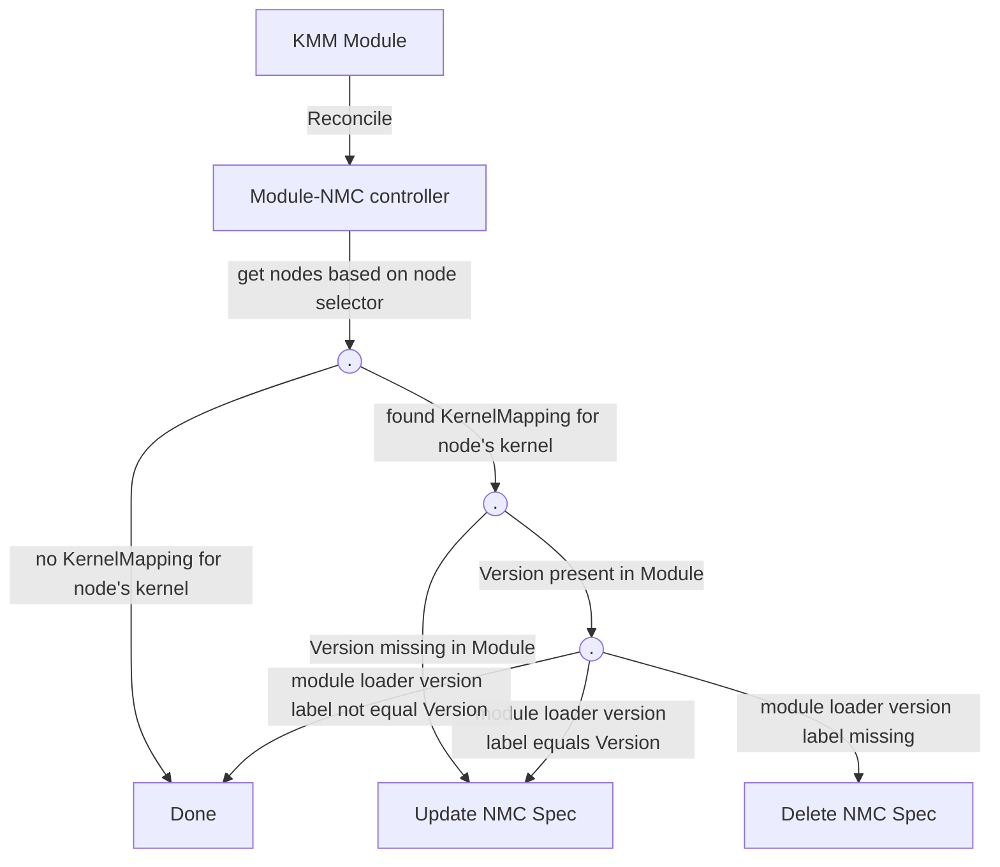
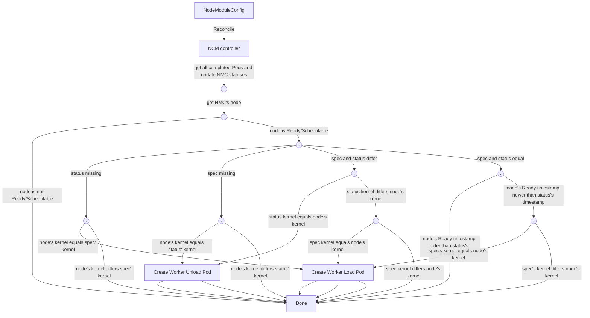

# Worker pods for KMM

Authors: @yevgeny-shnaidman, @ybettan

## Introduction

This enhancement aims at redifining areas of resposiblity between Module-NMC and NMC controllers.
This will allow for more clear-cut code and eliminate the variuos race-conditions that we are seeing(or will see) in the current situation

### Current situation

Currently both Module-NMC and NMC controller takes decision regarding kernel module deployment based on node status
- Module-NMC controller check the schedulability of the node in order to decide whether kernel module should be deployed or removed
  from the node (add/updating spec of the NMC or removing spec of the NMC)
- NMC controller check the node's schedulability to decide whether to start creating loading/unloading pod on the node. In addition it also
  check if the node has been recently rebooted, in order to create a loading pod, even if the status and spec of the NMC are equal.

This creates a situation where 2 entities decide whether kernel modules should be loaded or not based on a nodes' status

## Goals

1. Create a clear-cut distinction between responsibilities of the two controllers
2. Eliminate race conditions which are the result of the current situation

## Non-Goals

Do not change any other functionality of the two controllers, besides their decision making that is described above

## Design

### Module-NMC controller decision-making flow 

The flow takes into account both Module with Version field defined (ordered upgrade) and without Version field defined (un-ordered upgrade)
Module-NMC does not take into account the current state of the Node (Ready/NotReady/Schedulable/etc'). It just defines if the kernel module should
be loaded on the node or not based on whether there is a KernelMapping for the current node's kernel and on the labels of the node. All the rest of the decisions
will be taken by NMC reconciler, which has a much better view of Node's current state and kernel module's current state

1. Find all the nodes targeted by the Module regardless of node's status, based on the node selector field of the Module
2. If no suitable KernelMapping for the Node's kernel - do nothing
3. If there is a suitable KernelMapping and Version field missing in Module (not an ordered upgrade) - update the NMC spec
4. If there is a suitable KernelMapping, Version field is present in the Module, module loader version label is on the node and
   its value is equal to the Version - update the spec
5. If there is a suitable KernelMapping, Version field is present in the Module, module loader version label is on the node and 
   its value is not equal to Module's version (meaning old version) - do nothing
6. If there is a suitable KernelMapping, Version field is present in the Module, module loader version label is missing on the node
   (meaning kernel module should not be running on the node)  - delete the NMC spec

In this implementation, Module-NMC does not need to delete the spec, but in the 2 following cases:
1. during ordered upgrade (see point 6 above)
2. Module is deleted, and so the kernel module should be unloaded

### NMC controller decision-making flow

NMC takes into account the NMC spec, status, node's status and node's ready timestamp to make decision whether to run worker pods, and whether to run unload or load
worker pod

1. If Node is not Ready/Schedulable - do nothing
2. If NMC's status is missing and Node's kernel version equal to NMC's spec kernel version - run worker load pod
3. If NMC's spec is missing, NMC's status is present and NMC's status kernel version equal to Node's kernel version - run worker unload pod
4. If NMC's spec is present and NMC's status is present, and NMC spec differ from NMC status:
   - if status kernel version equal to node's kernel version - run worker unload pod
   - if spec's kernel version equal to node's kernel version - run worker load pod
5. If NMC's spec is present and NMC's status is present, and NMC spec equal to NMC status and status timestamp older then node's Ready timestamp - run worker load pod

## Addressing goal

* **clear-cut distinction between responsibilities of the two controllers**
  Module-NMC now specifies want it wants to run on the node, and NMC takes care of when to run it and how

* **Eliminating race conditions**
  Race conditin was due to both controllers looking at the same data Nodes's status and kernel, and making decisions based on that data.
  Now Module-NMC does not look at node's status, and NMC looks only at node's status and current kernel
