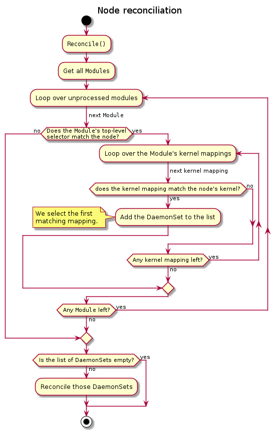

# Reconciliation loops

## Modules

Each time a new `Module` is created, we need to find to which nodes it applies.  
A first filtering is performed using the `.spec.selector` field, then we go through the module’s kernel mappings to
find a container image that matches the node’s kernel.
We end up with a certain number of (kernel, image) pairs; for each of these pairs, there should be a `DaemonSet`.  
We first look for a `DaemonSet` that would already be targeting the same kernel and DriverContainer image (that data is
stored in the `DaemonSet`’s labels).
If there is already such a `DaemonSet`, we update it, if needed.  
If there is not already a matching `DaemonSet`, we create it and set the `Module` as owner.

When a `Module` is deleted, we have nothing to do: because we set it as owner of all `DaemonSets`, Kubernetes garbage
collection will take care of deleting them.

## Nodes

Each time a `Node` is created or updated, we must verify which `Modules` apply to it.
The reconciliation process is similar to that of `Module`, except it is made in reverse.  
We first list all `Modules` and check which ones apply to the Node using each `Module`’s `.spec.selector` field.
We then iterate over the filtered `Modules`.  
For each `Module`, we try to find a suitable DriverContainer image by finding a kernelMapping that applies to the `Node`.
We select the first occurrence and store this in a list of (kernel, DriverContainer image) pairs.  
After we have looped over all modules that apply to the `Node`, we reconcile `DaemonSets` corresponding to these
(kernel, DriverContainer image) pairs like we did for `Modules`.

## DaemonSets

`Module` and `Node` reconciliation loops create and update `DaemonSets`, but they never actively destroy them.  
A `DaemonSet` should be deleted when it runs a DriverContainer image for a kernel that no `Node` runs anymore.  
Because we use the `DaemonSet`’s `nodeSelector` to target precise kernels, we can determine when a `DaemonSet` is
outdated and does not target any `Node` in the cluster: that is when its desired replicas is set by Kubernetes to 0.  
We can thus watch all `DaemonSets` managed by the operator, and delete those that are not targeting any node.

